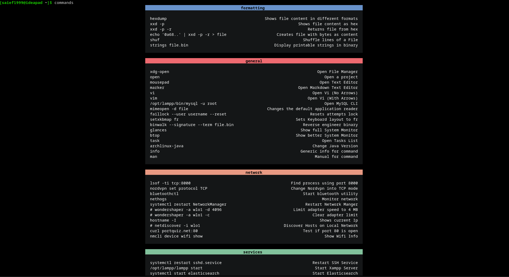

# utility-scripts

[](https://github.com/marketplace/actions/super-linter)

This repository contains a few scripts that I use generally when running my desktop environment. Also lists a couple of conventions/packages/tools that I usually use on linux systems.

## Scripts  

**commands** : A utility to store description on different commands. Useful when you forget your commands quite often ( like l3abdou lellah... ). Style heavily inspired from [nvChad](https://nvchad.com/)



**open** : A utility used as a shortcut to open projects & files fast.

## Useful packages

### CLI

- `yay` : An AUR helper used in Arch & Arch based distros. Helps building/updating AUR packages .
  - Syntax very similar to `pacman`, the default package manager for arch systems.
  - Handles conflicts & issues in a much better way than `pamac` (from personal experience).

- `paru` : Another very useful AUR helper, written in Rust.
  - Maintained by the biggest contributor of `yay`.
  - Syntax very similar to `yay`.
  - Relatively newer than `yay` (and less stable).

- `tldr` : A very useful CLI tool, shows brief documentation for CLI tools.
  - The examples are brief and straight forward, helps when we don't want to check the whole `man page` of the commands.

- `xclip` : Useful tool to copy and paste from the Terminal directly.

- `translate-shell` : Translate text directly from the CLI
  - Uses `google translate` by default, but can use other backends to translate with.
  - also supports TTS (Text To Speach).

- `dict` : An implementation of the DICT protocol. a CLI dictionary protocol.

- `peek` : Used to create gifs

- `direnv` : Separate the environment of different projects.
  - a simple `cd` into the project will load its `.envrc` containing all its env variables.
  - using a `cd` out of the project will unload all its env variables.

- `bat` : A `cat` clone with many extra functionalities.
  - Syntax highlighting
  - Git integration
  - Show non-printable characters with `-A` ( Saved my life many times! )

- `taskwarrior` : One of the best todo list managers from the CLI.
  - Highly configurable & very useful even in simple cases
  - Can show charts ( burndown ect... )

- `btop` : Alternative to `top` but with much more information.

- `nethogs` : Used to monitor network usage for processes.

- `neovim` : The future of vim!
  - Better copying/pasting mechanism
  - Cursor changes when in Insert mode, making changes easier

- `kitty` : a GPU based terminal emulator
  - Can show images
  - Supports emojis out of the box
  - Much faster then the default `xfce4-terminal`

### GUI

- `Obsidian` : A very useful Markdown editor
  - Clean and simple UI that gets the job done.
  - Completely free & no annoying popups! ( *wink* *wink* `typora` )

- `drawio-desktop` : Draw Diagrams for architectures offline.
  - Very useful when we don't have an internet connection, or when we don't want to use the web version.

- `Insomnia` : An API design plateform
  - Supports offline development with no hustle.
  - Much better than `Postman` ( which separates offline and online workspaces... )

- `Datagrip` : Useful to manage SQL databases from a unified frontend

- `beekeeper-studio` : An alternative to `Datagrip`
  - If we have no access to jetbrains products. We can use this instead.

- `VScode` : No introductions necessary

## Conventions & Practices

These are the personal conventions I use when I first set up any linux system.

- `~/.system/.init` : I use this file to store my aliases & Env variables. It's included in `~/.bashrc`.

- Regular usage directories need to have their own env variables, then exported in `~/.system/.init`

### Shortcuts To daily projects

for that I create a script `open`

I use this to open projects I work on daily, or files that I check regularly.

Check the `open` script for an example of usage.

It's also important to add the `open-completion` script to `~/.system/.init` like this, to enable completion for command names.

```bash
source path/to/open-completion
```

### Unloading the beeping module

In `/etc/modprobe.d/nobeep.conf` I add this:

```bash
blacklist pcspkr
```

The module becomes blacklisted at boot. Very useful to disable the annoying beep sound that we get sometimes.

for more info, check : [Archlinux Wiki - PC speaker](https://wiki.archlinux.org/title/PC_speaker)

### Copying directly from the terminal

For that I use the `xclip` package described above.

I add this alias to `~/.system/.init`

```bash
alias xclip='xclip -selection clipboard'
```

Then we can use it like this

```bash
echo "Stuff to copy" | xclip
```

### Supporting Syntax highlighting in cat

for that I use the `bat` package described above, with this alias in `~/.system/.init`

```bash
alias cat='bat -pp'
```

### Saving into the same file in bash

In bash:

- redirections are processed before the command is actually executed, but
- expansions are processed before redirections.

This means that for `cat file > file`, the output redirection (which truncates the file) occurs before cat is spawned, and cat now has an empty file to work with.

To avoid this. We can use `sponge` which is part of the `moreutils` package. By doing

```bash
cat file | sponge file
```

This is especially when we have many operations. and we want to save them into the same file.

```bash
cat file | sort | cut -d" " -f1 | head -n 5 | sponge file
```

Node that some commands have the ability to save into the same file already. like `sed -i` for example

### Add Swap (Very important)

Running out of memory in linux is never a good thing. The system will crash with no warnings. For that it's very important to add Swap memory ( 4 ~ 5 GB is enough )

There's no reason to add a swap partition in initial setup. We can do it later on using a `swap file` that we create. Both method are viable but the second is more flexible.

### Do not enable services for packages

Very important, we don't want anything to launch automatically at startup. Keep the services disabled and start them when necessary (to save memory)

### Cheatsheets

Check [Cheatsheets Repository](https://github.com/Saief1999/CheatSheets)

Books for topics should never be checked out with the repo. Instead we simply add their name to `CheatSheets/TOPIC/books/books.txt` and ignore them in `.gitignore` ( check existing topics for examples ).

### Security

We should put sensitive files inside a vault using `LUKS` and then mount it when needed.
